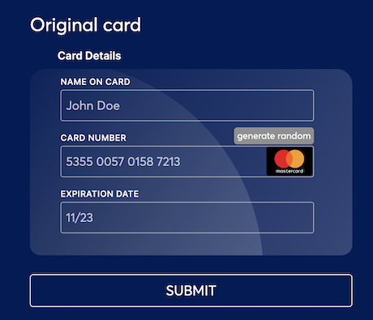
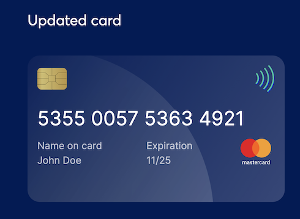

<p align="center"><a href="https://www.verygoodsecurity.com/"></a></p>
<p align="center"><b>CALM Real Time Enrollment Sample</b></p>


[](https://circleci.com/gh/vgs-samples/calm-real-time-enrollment/tree/main)


## CALM Real Time Enrollment Sample

Sample application showing an example of how to make initial real time enrollment of cards to CALM API.
Learn more about [VGS Payment Optimization](https://www.verygoodsecurity.com/docs/payment-optimization) solution and 
[CALM](https://www.verygoodsecurity.com/docs/payment-optimization/calm) in our official documentation.

Prior to running this sample, make sure to complete [CALM Onboarding](https://www.verygoodsecurity.com/docs/payment-optimization/calm/account-updater/onboarding) process.

### Environment

Sample is running on Sandbox by default. In order to run on Live environment specify value of `live` for `ENVIRONMENT` environment variable.

#### Pre-requisites
1. Generate [Vault Credentials](https://www.verygoodsecurity.com/docs/settings/access-credentials#generating-new-credentials) on [Vault Dashboard](https://dashboard.verygoodsecurity.com/) and save them. 
2. Generate [CALM API Credentials](https://www.verygoodsecurity.com/docs/payment-optimization/calm/api/authentication#api-credentials) and save them.
3. Run [Docker daemon](https://docs.docker.com/get-started/overview/).

#### Perform Real Time Enrollment

Run:

```bash
VAULT_ID='<VAULT_ID>' \
ENVIRONMENT="<ENVIRONMENT>" \
CALM_CLIENT_ID='<CALM_CLIENT_ID>' \
CALM_CLIENT_SECRET='<CALM_CLIENT_SECRET>' \
docker compose run calm-real-time-enrollment
```
Navigate to http://0.0.0.0:5000/, fill in credit card details and click submit:



In a few seconds you will get updated card:



## Next Steps
After enrolling your cards, you can get updated cards with synchronous [pull](https://www.verygoodsecurity.com/docs/payment-optimization/calm/account-updater#pull-updates) or asynchronous [push](https://www.verygoodsecurity.com/docs/payment-optimization/calm/account-updater#push-updates) model.

